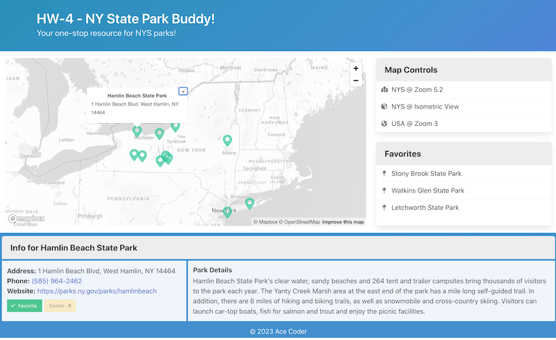
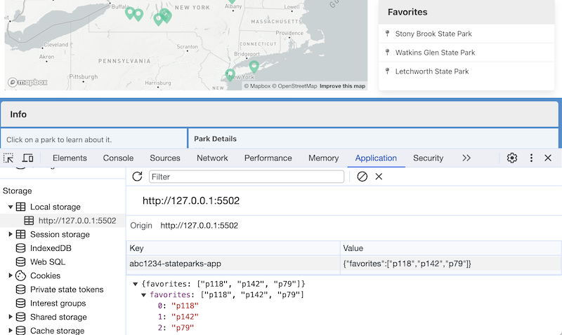
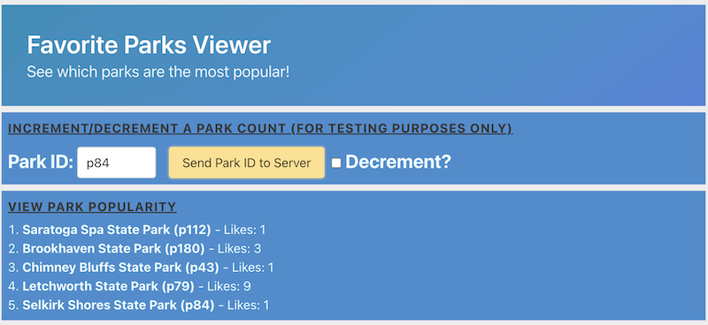

# HW-4 - *NY State Park Buddy*

---

## I. Complete the starter exercise

- Head to [HW-4 - NY State Park Buddy - Starter](hw-4-starter.md) and complete the exercise
- Make a copy of the ***lastName*-*firstInitial*-hw4-starter** folder and rename it to ***lastName*-*firstInitial*-hw4**
- The completed "starter" NYS Park zbuddy currently allows the user to:
  - view NYS parks as markers on a map
  - click on the markers to view more information about the park
- For this final version, additional features are:
  - Favoriting/unfavoriting
  - `localStorage` to persist a user's favoriting
  - Firebase integration to aggregate ALL users favoriting

---

## II. Functional Requirements

  **II-A) HW-4 starter has been completed and works perfectly**

  **II-B) The user can "favorite" and "unfavorite" parks by clicking "Favorite" and "Delete" buttons**
  
  - The "Favorites" panel will be immediately updated with these changes
  - Parks can only appear on the favorites list ONCE
  - The *state* of the "Favorite" and "Delete" buttons must be consistent
    - if the currently selected park is already a favorite, only the "Delete" button should be enabled
    - if the currently selected park is NOT a favorite, only the "Favorite" button should be enabled
    - if no park is selected, neither button should be enabled (or they could be hidden with `display: none`)
    - ***parks can be "selected" either by clicking their marker on the map OR by cliking their name in the "Favorites" Panel***

  **II-C) User favorites are preserved in `localStorage` so that when the user reloads the page the contents of the Favorites panel are preserved**

  - You should probably utilize **storage.js** from [Checkoff - `localStorage` Practice](https://github.com/tonethar/IGME-330-Master/blob/master/notes/localstorage-practice.md)
  - Don't forget to change the value of `storeName` to something that makes sense for this HW
  - Be sure that the app works in a "first run" scenario where the `favoriteIds` array has not yet been saved to `localStorage`:
    - meaning, if the data that was loaded from `localStorage` is not an array, `favoriteIds` can be initialized as an empty array
    - https://developer.mozilla.org/en-US/docs/Web/JavaScript/Reference/Global_Objects/Array/isArray
    - be sure to test your code at some point by deleting the `localStorage` data in the web inspector, and reloading the app. It should still function, with no inital favorites. And the user should be able to add and delete favorites, and have them saved

  **II-D) The frequency of favorites of ALL users can be seen on an admin page**

  - The name of this page is **favorite-parks-viewer.html**
  - Page styling is similar to **index.html**
  - The page will display the park id, the park name and the number of times it has been favorited
  - This Firebase demo will help you set this up - [4 - More Firebase - creating a likes counter for Dog names](https://github.com/tonethar/IGME-330-Master/blob/master/notes/firebase-4.md)
    - Hint: when the user clicks the "Favorite" button, use `likes: increment(1)` to *increment* the `likes` count
    - Hint: when the user clicks the "Delete" button, use `likes: increment(-1)` to *decrement* the `likes` count
  - NB: This page is an "app" that is separate and distinct from *NY State Park Buddy* app (**index.html**)
    - meaning, it will NOT import **main.js** and will instead have its own JS file (ex. **parks-viewer.js**)
    - there is no reason for it to import **map.js** or **storage.js**


<hr>

## III. Screenshots

---

- **Screenshot #1** - Initial page load - favorites are loaded in from `.localStorage` and shown on the right in the **"Favorites"** Panel
- Note that the "Favorite" and "Delete" buttons in the "Info" Panel are NOT visible


---

- **Screenshot #2**
  - After a park (Hamlin Beach State Park) is selected, its info is displayed in the **"Park Details"** Panel
  - Note the *state* of the buttons - because Hamlin Beach State Park is NOT a favorite, the "Add Favorite" button is *enabled* & the "Delete" button is *disabled*



---

- **Screenshot #3**
  - After a park (Stony Brook State Park) is selected, its info is displayed
  - Note the *state* of the buttons - because Stony Brook State Park IS a favorite, the "Add Favorite" button is *disabled* & the "Delete" button is *enabled*


---

- **Screenshot #4**
  - Reloading the page will load in the current favorites from `localStorage` and display them in the **"Favorites"** Panel
  - Adding/deleting favorites will update both `localStorage` and the **"Favorites"** Panel
  - See the example contents of `localStorage` in the web inspector below



---

- **Screenshot #5**
  - The  **favorite-parks-viewer.html** page displays the park id, the park name and the number of times it has been favorited
  - Bulma styling has been used so that the admin page has styling similar to **index.html**
  - ***NOTE: The "increment/decrement" functionality seen below is not required***



---

## IV. Rubric

**i. HW-4 starter has been completed and works perfectly (50%)**

**ii. Favoriting/unfavoriting works as described above (15%)**

**iii. Favorites saved to localStorage as described above (10%)**

**iv.  favorite-parks-viewer.html displays the frequency of all user's favorites as described above (25%)**

**v. Follow course coding standards**
  - [Course Code Style Requirements](../notes/code-style-required-330.md)
    - (-3%) per code style violation
  - For this HW you must use ES6 arrow functions (-3% per regular `function`)
  - Also:
    - Encapsulation - Limit direct access to your module's variables
    - Separation of concerns - keep each JS module focused on particular task(s) - example:
    - D.R.Y. - "Don't repeat yourself" - factor out repeated code into functions or methods

**vi. Do your own work, and follow RIT's Academic Integrity Policy**
  - Violations of this policy could result in an F in the course

---

## V. Hints and Tips (check back frequently - might be updated as needed)

1) You will likely implement `addToFavorites(id)` and `deleteFavorite(id)` methods in **main.js**

2) When working on the favoriting, a `currentParkId` or similar variable in **main.js** will come in handy
    - this variable will contain the id of the last park that was *selected* by the user
    - "selected" means a park's marker was clicked on, or a park's name in the "Favorites" panel was clicked on 

3) Here is some CSS that will help - especially with your "Favorites" panel:

```css
#details-3 p{
	margin-bottom: 1em !important;
}

#favorites-list{
	height: 144px;
	overflow: auto;
}
```

4) Buttons can be enabled/disabled with the `disabled` property
    - https://developer.mozilla.org/en-US/docs/Web/HTML/Attributes/disabled
    - https://www.w3schools.com/jsref/prop_pushbutton_disabled.asp

5) Displaying park ids and park names on **favorite-parks-viewer.html**
    - you only need to store the park id in Firebase
    - your JS can then use the park id to "look up" the park name. Here's an example data structure (OR, you could instead utilize the existing JSON parks data file):

```js
const parks = {
  "p79"   : "Letchworth State Park",
  "p20"   : "Hamlin Beach State Park",
  "p180"  : "Brookhaven State Park",
  "p35"   : "Allan H. Treman State Marine Park",
  "p118"  : "Stony Brook State Park",
  "p142"  : "Watkins Glen State Park",
  "p62"   : "Taughannock Falls State Park",
  "p84"   : "Selkirk Shores State Park",
  "p43"   : "Chimney Bluffs State Park",
  "p200"  : "Shirley Chisholm State Park",
  "p112"  : "Saratoga Spa State Park"
};
```

6) [HW-4 Helper? - Suggestion: create a firebase.js code module](../weekly/15A.md#iv-hw-4-helper---suggestion-create-a-firebasejs-code-module)


7) As is documented above, your `localStorage` functionality must work in a "first run" scenario - which you can test by deleting the `localStorage` data in the browser (under the **Application** tab) and then reloading the page. Here's the code that did that for the  localStorage checkoff, by first checking to see if there was an array of `items`, and if there was not, `items` was initialized to an empty array.

```js
items = storage.readFromLocalStorage("items");
if(!Array.isArray(items)) items = [];
showItems();
```

---


## VI. FAQ & Errata (check back frequently - might be updated as needed)

- ***Will I need to create a NEW Firebase project at https://console.firebase.google.com ?***
  - No, you can re-use the project you created on the "Firebase High Scores" PE. You'll just need a new property name for the `ref()` - something like `park-favorites` will work
- ***May I change the color scheme of the app?***
  - Please do!
- ***Is it OK to change the 2 "Favorite" and "Delete" buttons, to just one button that toggles between those 2 states?***
  - Yes. That's just like we did on the Audio Visulizer HW, and it's the better way to do it.  Just be sure that parks can only be Favorited/Unfavorited only once, both locally and on the favorites viewer page. Also be sure that the button text is consistent, 

---

## VII. Submission

- Put the files from above into a parent folder named ***lastName*-*firstInitial*-hw4**
  - (-5%) for a misnamed folder
- ZIP the folder and post to myCourses
