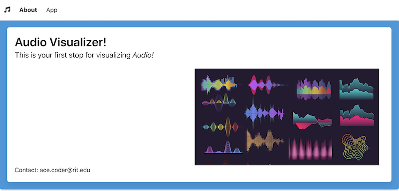

# HW3 - Bulma Notes

## I. An 'About' Page is required
- A good starting point is **home.html** from [PE-08 - Bulma I - Intro to Bulma](../pe/pe-08.md)
- The name of the page must be **about.html**
- It must have a navigation system that includes a hamburger menu
- It must have text that describes the project (meaning, get rid of the "hotdog" text)
- It must have at least one image that is related to the project (meaning, get rid of the "hotdog" image)
- It must have your contact info on it (meaning, get rid of Ace Coder's info)
- The colors chosen for backgrounds/fonts etc should be consistent with **index.html**
- To keep the hamburger menu functional, rename **index.js** to **hamburger.js** and import it with a `<script>` tag
- See example screenshots below

## II. An 'App' Page is required
- A good starting point is **home.html** from [PE-08 - Bulma I - Intro to Bulma](../pe/pe-08.md)
  - NB: if you are going to have multiple columns and/or rows in your app page layout (almost a certaintly), you will also want to review PE-08's "index" pages that demoed how to lay out columns and rows in Bulma 
- The name of the page must be **index.html**
- It must have a navigation system that includes a hamburger menu
- The colors chosen for backgrounds/fonts etc should be consistent with **index.html**
- To keep the hamburger menu functional, rename **index.js** to **hamburger.js** and import it with a `<script>` tag OR move that code to `setupUI()` or similar
- See example screenshots below

## XX. Screenshots

### index.html 

### index.html (mobile)
- ***Note: It's OK if your `<canvas>` is not fully responsive and does not shrink to fit the screen***

### about.html

### about.html (mobile)

