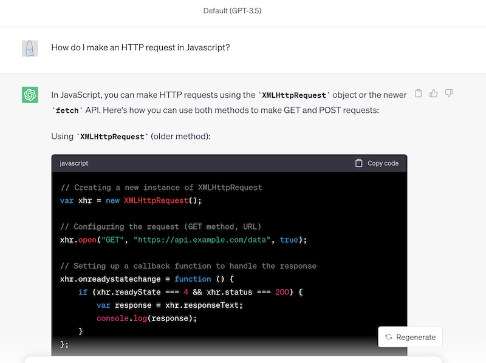
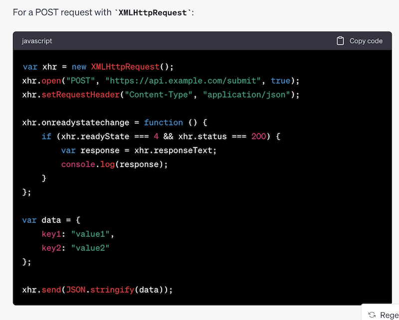
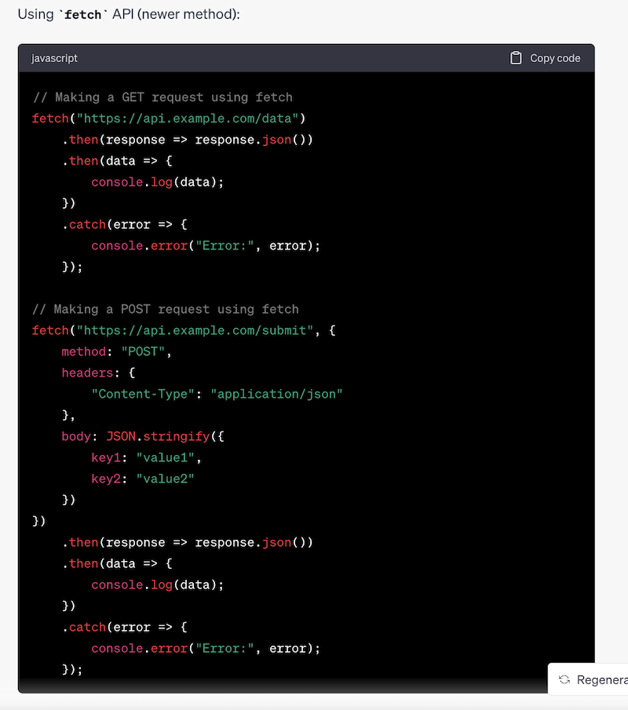
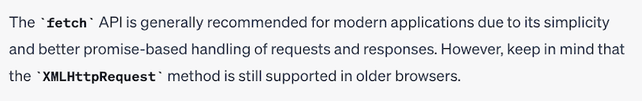

# Using ChatGPT in this class

## I. Here's an allowable use of ChatGPT in this course - as a research tool
- ... imagine that you need to download some data from the Interwebs, using JavaScript ...
- ... and you don't know how to do it ...
- Let's see what Generative AI can do for us!
- [ChatGPT 3.5 - How do I make an HTTP request in Javascript?](https://chat.openai.com/c/5093bcc2-39ec-455e-a611-647ef44741f8)
- Clicking on the link above should give you a "live" answer (assuming you have a free account) - below is a capture from a few days ago

## II. So now you've got some code!

- **Four** distinct solutions are given ...
- Some might just copy/paste the first answer? (A common and unfortunate Stackoverflow.com "workflow" ...)
  - but as stated in the syllabus - *"If I doubt authorship, I may ask you to explain the code or re-create aspects of the code"*
- Questions you might have about this code:
  - What is the difference between a `GET` and a `POST` Request? Which should I use?
  - What exactly IS a "callback function"?
  - Should I use `XHR` or `fetch()`? What are the advantages and disadvantages of each?
  - The first code block sets a *request header* - what's that? Is it necessary to set those?
  - What are the `readyState` and `status` properties? What do these represent? What are their possible values?
  - The first code block uses `var` (not allowed in this course) and the `function` keyword instead of the arrow functions seen in the later code examples. Does this mean that `XHR` only works with `var` and `function`?
  - What does `JSON.stringify()` do?
  - What are `.then()` and `.catch()` and *Promises*?
  - Why are there 2 `.then()` methods chained together?
  - `XHR` is supported in older browsers, does that mean it's NOT supported in newer browsers?

## III. Discussion

- ***Before you utilize ("hand in") any of the code from above, you should be able to answer most of the above questions***
- You will undoubtedly need to re-factor some of this code:
  - `let` and `const` instead of `var`
  - named arrow functions where possible to aid in debugging
  - get rid of unnecessary code (ex. don't always need to send headers)
  - add more error handling
  - turn the refactored code into a reusable "helper" function
  - and so on ...
- Unless you are already initimately familiar with the HTTP protocol (request methods, request & response headers and status codes), callbacks, promises, etc - more research will need to be done:
  - Continue the conversation with ChatGPT (asking specifics about `GET` v. `POST` etc)?
  - Head to [MDN docs](https://developer.mozilla.org/en-US/docs/Web/HTTP)?
  - Watch your favorite JS YouTuber?
  - Ask in the Course Slack?
  - Ask the Professor? `:-O`

