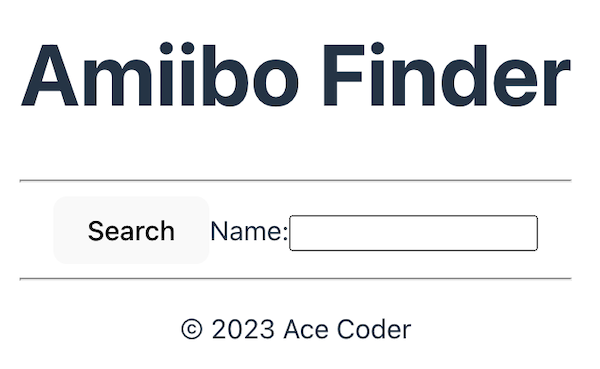
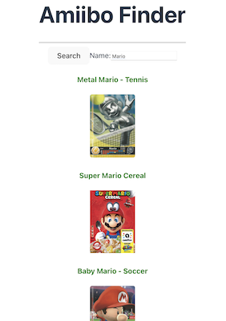
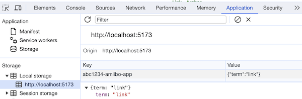

# React Amiibo App

## I. Overview
- Let's see how we can build a React app that consumes a web service
  - we will get more practice with components ...
  - and with React's *"Reactivity"* - meaning *data binding* ...
  - and with 2 of the 3 "core" React hooks:
    - [`useState()`](https://react.dev/reference/react/useState)
      - [State: A Component's Memory](https://react.dev/learn/state-a-components-memory)
    - [`useEffect()`](https://react.dev/reference/react/useEffect)
      - [Synchronizing with Effects](https://react.dev/learn/synchronizing-with-effects)
      - [You Might Not Need an Effect](https://react.dev/learn/you-might-not-need-an-effect)
    - [`useContext()`](https://react.dev/reference/react/useContext)
      - [Passing Data Deeply with Context](https://react.dev/learn/passing-data-deeply-with-context)
  - we will also utilize the [`useMemo`](https://react.dev/reference/react/useMemo) React hook to *cache* a value
---

## II. Amiibo API

- Docs: https://amiiboapi.com/docs/
- Playground: https://amiiboapi.com/
- Sample call: https://www.amiiboapi.com/api/amiibo/?name=mario

---

## III. Get Started

- Create folder named **amiibo-app** and `cd` into it
- Type: `npm create vite@latest`
  - for *Project name*: **type a period** (`.`) to create a project in current **todo-app** folder
  - for *Framework*: choose **React**
  - for *Variant*: choose **JavaScript**
- `npm i`
- `npm run dev`
- Head to localhost to see app running in browser
- Get rid of some of the unneeded web files, but keep:
  - **App.jsx**
  - **App.css**
  - **index.html**
    - change the `<title></title>` to "Amiibo Finder"
  - **index.css**
    - to get rid of the vertical centering, comment out or delete `min-height: 100vh;`
  - **main.jsx**
- Make **App.jsx** look like this:

```jsx
import { useState } from "react";
import './App.css'

const App = () => {
  return <>
    <header>
      <h1>Amiibo Finder</h1>
    </header>
    <hr />
    <main>
      <button>Search</button>
      <label>
        Name: 
        <input />
      </label>
    </main>
    <hr />
    <footer>
      <p>&copy; 2023 Ace Coder</p>
    </footer>
  </>;
};

export default App;
```

- View the app in the web browser to be sure it compiles - see below:

---


  
---

## IV. Create an XHR helper function

- In **App.jsx**, *above* the `App` component, declare this constant

```js
// app "globals" and utils
const baseurl = "https://www.amiiboapi.com/api/amiibo/?name=";
```

- And implement the `loadXHR()` helper function

```js
const loadXHR = (url, callback) => {
  // set up the connection
  // when the data loads, invoke the callback function and pass it the `xhr` object
};
```

- And here's `searchAmiibo()` - all done:

```
const searchAmiibo = (name, callback) => {
  loadXHR( `${baseurl}${name}`, callback);
};
```

---

## V. Create a callback function

- To test our `searchAmiibo(name, callback)` helper function, let's write a callback function that will be invoked when the amiibo data has downloaded:

```js
 const parseAmiiboResult = xhr => {
    // get the `.responseText` string
   
    // declare a json variable
   
    // try to parse the string into a json object
    
    // log out number of results (length of `json.amiibo`)
    console.log(`Number of results=${json.amiibo.length}`);
    
    // loop through `json.amiibo` and log out the character name
  };
```

---

## VI. Test it

- Now everything should work, check the console to be sure
- Try substituting "luigi", "peach" and "rit" to see what you get back

```js
  // call searchAmiibo() with "mario" and our callback function
  searchAmiibo("mario", parseAmiiboResult); // DONE
```

--- 

## VII. Hook the code up to the UI

- Goal: When we click the button, we want to see the web service results of the typed in search term (character name)
- We will need a `useState()` call for `term`
  - need to bind the `<input>` `.value` to `term`
  - need to update `term` whenever `.value` changes
- We need to get button clicking working (fire up `xhr` and download the amiibo data)
- We will need a `useState()` call for `results` (an array of object literals)
- We need to display the `results`

```jsx
      {results.map(amiibo => (
        <span key={amiibo.head + amiibo.tail} style={{color:"green"}}>
          <h4>{amiibo.name}</h4>
          
        </span>
      ))}
```

- Note the rReact need for a unique `key` when producing lists like this
- Also note the syntax for the use of an inline `style` - using a `class` for styling is generally preferred in React

---
  
- Next, we need to update `results` when the amiibo data has loaded
  - move `parseAmiiboResult(xhr)` into the `App` component and make a small addition
- When you are done, you should have a functioning app:

---



---

- Now go ahead and move `const searchAmiibo = (name, callback)...` into the `App component`
- Also delete all of the `console.log()` calls - except for the one that's in the `catch` block

---

## VIII. A little refactoring - ajax.js - a "plain old JS" file

- Go ahead and create a file in the **src** folder named **ajax.js**
  - move `const loadXHR = (url, callback) =>...` into it and `export` it
  - now `import` it into **App.jsx** - `import { loadXHR } from "./ajax";`
    - note that we don't need the file extension for the file when we `import` it
  - test the app, it should work as before
  - now the only "global" you have left in **App.jsx** is `const baseurl =...`
 
---

## IX. storage.js
- We are going to utilize `window.localStorage` to save the current search term, so that when the user leaves the app (closes the window, quits the browser, restarts the computer etc), and then later returns, that search term will still be in the `<input>` as if they never left
- Create a new file named **src/storage.js** - and make it look like this:

```js
const storeName = "abc1234-amiibo-app";

const loadJSONFromLocalStorage = () => {
  const string = localStorage.getItem(storeName);
  let json;
  try{
    json = JSON.parse(string);
    if(!json) throw new Error("json is null!");
  }catch(error){
    console.log(`ERROR: ${error} with string: ${string}`);
    json = {};
  }
  return json;
};

export const writeToLocalStorage = (key, value) => {
  console.log(`Calling writeToLocalStorage(${key},${value})`);
  const json = loadJSONFromLocalStorage();
  json[key] = value;
  localStorage.setItem(storeName, JSON.stringify(json));
};

export const readFromLocalStorage = (key) => {
  const json = loadJSONFromLocalStorage();
  console.log(`Calling readFromLocalStorage(${key}) with value=${json[key]}`);
  return json[key];
}
```

- Over in **App.jxs**, `import` it
  - `import { readFromLocalStorage, writeToLocalStorage } from "./storage";`
- N.B. - this code is more than we need to store a single string value, and was deliberately over-engineered so that you could (for example) easily also save an array of search terms (the search *history*), or an array of results to local 

---

## X. Utilize storage.js

- We are going to save the search `term` every time the value of `term` changes (which is tied to the `onChange` event handler of the `<input>`)
- We are going to use the `useEffect()` hook to do so
- Go ahead and modify your `react` import to also bring in `useEffect`
  - `import { useEffect, useState } from "react";`
- Add the following code to the `App` component right after the two `useEffect()` calls

```jsx
useEffect(() => {
  writeToLocalStorage("term", term);
});
```

- `useEffect()` will call the provided function - which saves the value of `term` to local storage - every time the `App` component is re-rendered
- Do a search by clicking the Search button, or type in a different name. Then check `localStorage` in the browser's web inspector (the **Application** tab) to see that the value of `term` is being saved

---



---

## XI. Optimization

- Right now `useEffect()` is being called every time the `App` component re-renders (for example, when the Search button is clicked), even if the value of `term` has not changed
  - to make it so that `useEffect()` will only be called when the value of `term` changes, add a *dependencies array* to the end:
 
```jsx
useEffect(() => {
  writeToLocalStorage("term", term);
}, [term]);
```

- Test the app by clicking the Search button and check the console, there should be fewer logs from the storage functions, as they will only be called when `term` changes
  - N.B. In development mode (the mode we are in now), React does some extra re-rendering of components
- Now let's load the value of `term` from `localStorage` when the app first loads - go ahead and make the first part of the `App` component look like this:

```jsx
const App = () => {
  const savedTerm = readFromLocalStorage("term") || "";
  const [term, setTerm] = useState(savedTerm);
  const [results, setResults] = useState([]);

  useEffect(() => {
    writeToLocalStorage("term", term);
  }, [term]);

  const parseAmiiboResult = xhr => { ...
```

- We should now see the last search `term` in the `<input>` whenever we reload the web page, or even if we close the window and reopen it
- One problem though - if you check the console you can see that the `savedTerm` code is running too much - every time the component is re-rendered
- To fix this and further optimize our code, we can use another hook [`useMemo`](https://react.dev/reference/react/useMemo) - which *"is a React Hook that lets you cache the result of a calculation between re-renders"*
- Go ahead and chnage this:

```jsx
const savedTerm = readFromLocalStorage("term") || "";
```

- To this:

```jsx
const savedTerm = useMemo(() => readFromLocalStorage("term") || "", []);
```

- And don;t neglect to import `useMemo` at the top of **App.jsx**
- The empty array - `[]` - that is last parameter of `useMemo()` tells React to "only run this code once"
- Do a search and check the console, there should not be any storage function logs unless we change the search term
